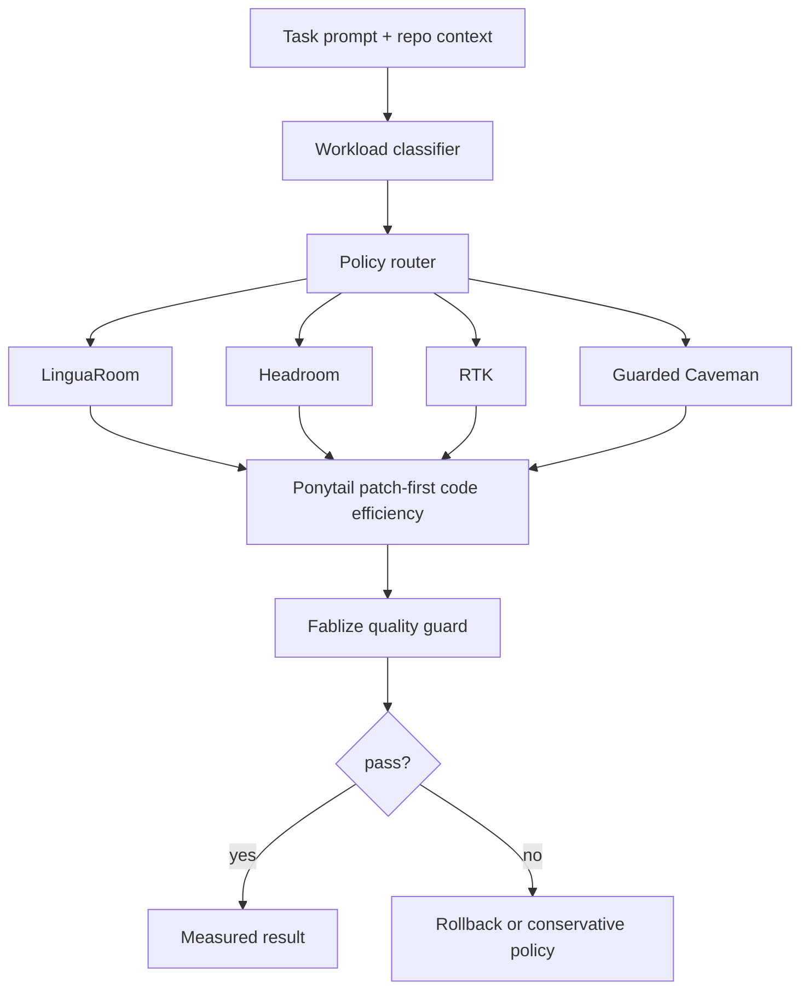

# Architecture

Z.I.P. is a four-layer adaptive pipeline.

The harness measures baseline and candidate prompt tokens before making any claim. Policies are composable candidates, not global defaults.
