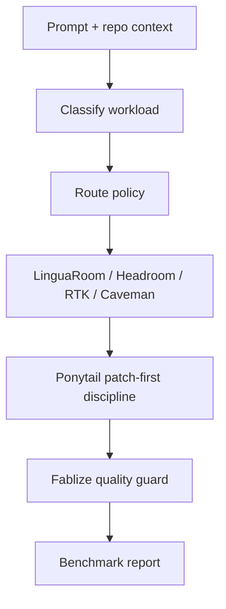

# Judge Packet

## Executive Summary

Z.I.P. Agent is a measurement-first prompt-saving framework for coding agents. It routes Korean/English engineering prompts through safe compression candidates, measures token/cost/latency effects, and blocks aggressive compression when deterministic quality gates detect risk.

## Problem Definition

Coding-agent workflows repeatedly send task restatements, repository summaries, stack traces, acceptance criteria, and full-file context. This creates avoidable spend and latency, especially in multilingual teams.

## Why Korean Coding-Agent Prompts Waste Tokens

Korean prompts often include translation instructions, bilingual duplicated intent, English API names, Korean acceptance criteria, and repeated clarification scaffolds. Blind shortening can remove the Korean intent or the English code symbol that the model needs.

## Architecture



## Benchmark Method

Command:

```bash
python -m zip_agent.cli benchmark --dataset benchmarks/tasks/korean_coding_prompts.jsonl --policies baseline,linguaroom,headroom,rtk,caveman,zip-auto --repeats 3 --report reports/latest.md
```

Dataset: 22 Korean coding-agent tasks, 132 policy result rows.

Mode: dry-run deterministic fixture mode.

Evidence fields: the markdown report records repeat count, provider cache status, latency variance/stdev, judge provenance, and threshold summary alongside the existing benchmark table.

## Results Table

| metric | observed dry-run value |
| --- | ---: |
| All-policy average input-token saving | 0.9% |
| All-policy quality-pass rate | 36.4% |
| Z.I.P. Auto average input-token saving | 1.8% |
| Z.I.P. Auto quality-pass rate | 54.5% |
| Best passing policy row | `kr-debug-001` with `zip-auto`, 22.5% saving |
| Unsafe Caveman failures caught | 19 |

## Ablation

Baseline establishes the combined prompt token count. LinguaRoom often improves quality preservation but may increase tokens because the placeholder explicitly lists preserved identifiers. Headroom is conservative in the current corpus. RTK wins on repeated prompts. Caveman saves tokens in some low-risk rows but is blocked on high-risk rows. Z.I.P. Auto favors quality and accepts modest savings.

## Failure Cases

- `linguaroom` can add tokens when identifier preservation text is longer than removed boilerplate.
- `caveman` is unsafe for security, design, ambiguous, and high-risk tasks.
- Dry-run output quality is not a live model quality result.

## Safety/Quality Guard

The guard checks acceptance criteria, identifier preservation, verification evidence, early-stop language, and policy-risk mismatches. Failed quality gates cap the total score.

## More Than Prompt Shortening

Z.I.P. measures baseline versus candidate prompts, routes by workload, blocks risky policies, and writes reproducible reports. It is an adaptive measurement pipeline, not a global prompt minifier.

## How To Reproduce

Run the benchmark command above, then inspect `reports/latest.md`.

## Final Claim Statement

In our dry-run benchmark, Z.I.P. Auto reduced 1.8% input tokens on 22 Korean coding-agent tasks while preserving a 54.5% deterministic quality-pass rate. The system achieves this by routing each workload to the safest compression policy and rejecting aggressive compression when the Fablize-inspired quality gate detects risk.
